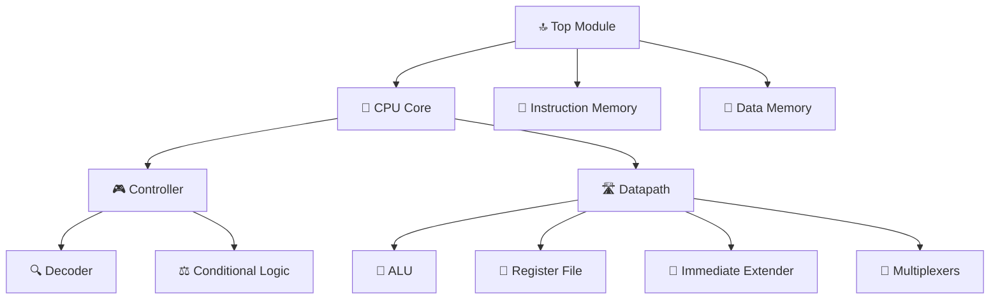

# 🚀 ARM-Based 32-Bit Single-Cycle RISC Processor

<div align="center">

```
    ╔═══════════════════════════════════════════════════════════════╗
    ║                    🔥 ARM32 RISC PROCESSOR 🔥                ║
    ║           Educational • FPGA-Ready • Single-Cycle            ║
    ╚═══════════════════════════════════════════════════════════════╝
```

 
 
 


**A comprehensive 32-bit ARM-style RISC processor implementation in Verilog HDL**  
*Perfect for computer architecture education and FPGA development*

</div>

---

## ✨ **Highlights**

<table>
<tr>
<td width="50%">

### 🎯 **Core Features**
🔧 **Single-Cycle Architecture** - Complete instruction execution in one clock cycle  
🧠 **ARM-Style ISA** - Data processing, memory access, and branch instructions  
🎮 **Conditional Execution** - Full ARM condition code support (15 conditions)  
⚡ **FPGA-Optimized** - Synthesizable design tested on Nexys A7-100T  

</td>
<td width="50%">

### 📊 **Quick Stats**
- **🏗️ Architecture**: 32-bit RISC, Harvard Architecture
- **⚙️ Pipeline**: Single-cycle (CPI = 1.0)  
- **💾 Memory**: 64×32 ROM + 64×32 RAM
- **🔢 Registers**: 16×32-bit (R0-R15)
- **🚀 Max Frequency**: 66+ MHz on Artix-7

</td>
</tr>
</table>

---

## 🏗️ **Project Architecture**

<div align="center">



</div>

## 📂 **Module Organization**

<div align="center">

| 🏷️ **Category** | 📄 **Module** | 🔍 **Description** |
|:---:|:---:|:---|
| **🎮 Core Control** | `top.v` | 🔝 System integration & FPGA interface |
| | `CPU.v` | 🧠 Main processor wrapper (datapath + control) |
| | `controller.v` | 🎛️ Control unit orchestration |
| | `decoder.v` | 🔍 Instruction decoder & signal generation |
| **🛣️ Datapath** | `data_path.v` | 🛤️ Complete 32-bit datapath implementation |
| | `alu.v` | 🧮 Arithmetic Logic Unit (ADD/SUB/AND/OR + Flags) |
| | `regfile.v` | 📁 16×32-bit register file with PC handling |
| | `adder.v` | ➕ Generic 32-bit adder for addresses |
| | `mux2.v` | 🔀 Parameterized 2-to-1 multiplexer |
| | `extender.v` | 📏 Immediate value extender/sign-extender |
| | `flop.v` | 🔄 32-bit D flip-flop for PC storage |
| **🧠 Control Logic** | `conditional_logic.v` | ⚖️ ARM conditional execution & flag management |
| **💾 Memory** | `instr_mem.v` | 📖 64×32-bit instruction ROM |
| | `data_mem.v` | 💽 64×32-bit data RAM (byte-addressable) |
| **🧪 Verification** | `testbench.v` | 🔬 Comprehensive testbench suite |
| | `memfile.data` | 📋 Sample program in hex format |
| **🔌 Hardware** | `nexys_A7_arm32_const.xdc` | 🎚️ FPGA pin constraints & timing |

</div>

---

## 🔧 **Instruction Set Architecture**

### 📋 **32-bit ARM-Style Instruction Formats**

<div align="center">

```
┌─ DATA PROCESSING ─────────────────────────────────────────────────────────┐
│ 31   28│27 26│25    20│19   16│15   12│11    8│7      0│
│  Cond  │ 00  │ Funct  │  Rn   │  Rd   │ Shift │  Imm8  │
└────────┴─────┴────────┴───────┴───────┴───────┴────────┘

┌─ MEMORY ACCESS ───────────────────────────────────────────────────────────┐
│ 31   28│27 26│25│24│23│22│21│20│19   16│15   12│11           0│
│  Cond  │ 01  │I │P │U │B │W │L │  Rn   │  Rd   │   Offset12   │
└────────┴─────┴──┴──┴──┴──┴──┴──┴───────┴───────┴──────────────┘

┌─ BRANCH ──────────────────────────────────────────────────────────────────┐
│ 31   28│27 26│25                                              0│
│  Cond  │ 10  │                   Offset24                      │
└────────┴─────┴─────────────────────────────────────────────────┘
```

</div>

### 🎯 **Supported Operations**

<table align="center">
<tr>
<th>🏷️ Category</th>
<th>⚙️ Operations</th>
<th>📝 Examples</th>
</tr>
<tr>
<td><b>🔢 Data Processing</b></td>
<td>ADD, SUB, AND, OR<br>with immediate & register modes</td>
<td><code>ADD R2, R0, #5</code><br><code>SUB R7, R3, R4</code></td>
</tr>
<tr>
<td><b>💾 Memory Access</b></td>
<td>LDR, STR<br>with 12-bit offset</td>
<td><code>LDR R2, [R0, #96]</code><br><code>STR R7, [R3, #84]</code></td>
</tr>
<tr>
<td><b>🔀 Control Flow</b></td>
<td>Conditional & unconditional branches</td>
<td><code>BEQ label</code><br><code>B +4</code></td>
</tr>
</table>

---

## 🎮 **Conditional Execution System**

<div align="center">

| 🔢 **Code** | 🏷️ **Mnemonic** | 🧪 **Condition** | 🚩 **Flag Test** |
|:---:|:---:|:---:|:---:|
| `0000` | **EQ** | Equal | `Z = 1` |
| `0001` | **NE** | Not Equal | `Z = 0` |
| `0010` | **CS/HS** | Carry Set/Higher Same | `C = 1` |
| `0011` | **CC/LO** | Carry Clear/Lower | `C = 0` |
| `0100` | **MI** | Minus/Negative | `N = 1` |
| `0101` | **PL** | Plus/Positive | `N = 0` |
| `0110` | **VS** | Overflow Set | `V = 1` |
| `0111` | **VC** | Overflow Clear | `V = 0` |
| `1000` | **HI** | Higher | `C=1 & Z=0` |
| `1001` | **LS** | Lower or Same | `C=0 ∣ Z=1` |
| `1010` | **GE** | Greater or Equal | `N = V` |
| `1011` | **LT** | Less Than | `N ≠ V` |
| `1100` | **GT** | Greater Than | `Z=0 & N=V` |
| `1101` | **LE** | Less or Equal | `Z=1 ∣ N≠V` |
| `1110` | **AL** | Always | `Always true` |

</div>

---

## 🧮 **Detailed Instruction Decoding**

### 🔢 **Data Processing Instructions** (`op = 00`)

<details>
<summary><b>🔍 Click to expand decoding details</b></summary>

#### 📋 **Field Breakdown**
- **🎯 Condition [31:28]**: Conditional execution code
- **⚙️ Op [27:26]**: `00` for data processing
- **🔧 Funct [25:20]**: Operation control
  - `funct[5]`: I-bit (0=register, 1=immediate)
  - `funct[4:1]`: Opcode (0100=ADD, 0010=SUB, 0000=AND, 1100=ORR)
  - `funct[0]`: S-bit (update flags when set)

#### 🎛️ **Control Signal Generation**
```verilog
case(op)
2'b00: begin 
    if(funct[5])     // Immediate mode (I=1)
        control = 10'b0011001x01;
    else             // Register mode (I=0)
        control = 10'b0000xx1001;
end
```

#### 📝 **Example**: `E2802005` (ADD R2, R0, #5)
- `E` [31:28]: Always condition (1110)
- `00` [27:26]: Data processing
- `100000` [25:20]: ADD immediate, no flags
- `0` [19:16]: Source R0
- `2` [15:12]: Destination R2
- `05` [7:0]: Immediate value 5

</details>

### 💾 **Memory Instructions** (`op = 01`)

<details>
<summary><b>🔍 Click to expand memory access details</b></summary>

#### 📋 **Address Calculation**
```
Effective Address = Base Register + Sign_Extend(Offset12)
```

#### 🔄 **Load vs Store Operations**

| 🏷️ **Operation** | 🎛️ **Control** | 🔄 **Data Flow** |
|:---:|:---:|:---:|
| **📥 Load (L=1)** | `regW=1, memW=0, mem_to_reg=1` | Memory → Register |
| **📤 Store (L=0)** | `regW=0, memW=1, mem_to_reg=X` | Register → Memory |

#### 📝 **Example**: `E5837054` (STR R7, [R3, #84])
- `E` [31:28]: Always condition
- `01` [27:26]: Memory operation  
- `0` [20]: Store (L=0)
- `3` [19:16]: Base register R3
- `7` [15:12]: Source register R7
- `054` [11:0]: Offset 84 bytes

</details>

### 🔀 **Branch Instructions** (`op = 10`)

<details>
<summary><b>🔍 Click to expand branch details</b></summary>

#### 🎯 **Branch Target Calculation**
```
Branch Target = PC + 8 + (SignExtend(Offset24 << 2))
```

#### 📏 **Range & Alignment**
- **📐 Range**: ±32MB from current PC
- **🔧 Alignment**: Automatic 4-byte word alignment
- **📊 Offset Processing**: 24-bit signed with left-shift-2

#### 📝 **Example**: `0A00000C` (BEQ +12)
- `0` [31:28]: EQ condition (branch if Z=1)
- `10` [27:26]: Branch operation
- `00000C` [23:0]: Offset +12 words (48 bytes)

</details>

---

## 🔬 **Sample Program Analysis**

<div align="center">

```assembly
📊 PROGRAM EXECUTION TRACE
╭─────────────────────────────────────────────────────────────╮
│  Address  │   Hex Code   │      Assembly       │   Result   │
├───────────┼──────────────┼─────────────────────┼────────────┤
│    0x00   │   E04F000F   │   MOV R0, #15       │   R0 = 15  │
│    0x04   │   E2802005   │   ADD R2, R0, #5    │   R2 = 20  │
│    0x08   │   E280300C   │   ADD R3, R0, #12   │   R3 = 27  │
│    0x0C   │   E2437009   │   SUB R7, R3, #9    │   R7 = 18  │
│    0x10   │   E1874002   │   ORR R4, R7, R2    │   R4 = 22  │
│    0x14   │   E0035004   │   AND R5, R3, R4    │   R5 = 18  │
│    0x18   │   E0855004   │   ADD R5, R5, R4    │   R5 = 40  │
│    0x1C   │   E0558007   │   SUBS R8, R5, R7   │   R8 = 22  │
│    0x20   │   0A00000C   │   BEQ skip          │  Not taken │
│    0x24   │   E0538004   │   SUBS R8, R3, R4   │   R8 = 5   │
│    0x28   │   AA000000   │   BGE loop          │   Taken!   │
╰─────────────────────────────────────────────────────────────╯
```

</div>

---

## 🖥️ **FPGA Implementation**

### 🎛️ **Nexys A7-100T Pin Configuration**

<div align="center">

```
        🔌 HARDWARE INTERFACE 🔌
    ╭─────────────────────────────────────╮
    │  💡 LEDs [15:0]     🔗 PMOD JA [23:16]  │
    │  ┌─┬─┬─┬─┬─┬─┬─┬─┐  ┌─┬─┬─┬─┬─┬─┬─┬─┐  │
    │  │0│1│2│3│4│5│6│7│  │ │ │ │ │ │ │ │ │  │
    │  └─┴─┴─┴─┴─┴─┴─┴─┘  └─┴─┴─┴─┴─┴─┴─┴─┘  │
    │  ┌─┬─┬─┬─┬─┬─┬─┬─┐      🔗 PMOD JB      │
    │  │8│9│A│B│C│D│E│F│  ┌─┬─┬─┬─┬─┬─┬─┬─┐  │
    │  └─┴─┴─┴─┴─┴─┴─┴─┘  │ │ │ │ │ │ │ │ │  │
    │      💡 LEDs          └─┴─┴─┴─┴─┴─┴─┴─┘  │
    │                      [31:24]           │
    ╰─────────────────────────────────────────╯
         32-bit Memory Location 21 Display
```

</div>

### ⚡ **Performance Specifications**

<table align="center">
<tr>
<td><b>🏷️ Parameter</b></td>
<td><b>📊 Value</b></td>
<td><b>📝 Notes</b></td>
</tr>
<tr>
<td>🕐 <b>Clock Frequency</b></td>
<td>66+ MHz</td>
<td>15ns period constraint</td>
</tr>
<tr>
<td>⚡ <b>Power Supply</b></td>
<td>3.3V LVCMOS</td>
<td>All I/O pins</td>
</tr>
<tr>
<td>🔧 <b>Resource Usage</b></td>
<td>~500 LUTs</td>
<td>XC7A100T-1CSG324C</td>
</tr>
<tr>
<td>🎯 <b>CPI</b></td>
<td>1.0</td>
<td>Single-cycle execution</td>
</tr>
</table>

---

## 🚀 **Quick Start Guide**

### 📦 **1. Repository Setup**
```bash
# 📥 Clone the repository
git clone https://github.com/your-username/arm32-processor
cd arm32-processor

# 📋 Verify all files are present
ls *.v *.data *.xdc
```

### 🧪 **2. Simulation**
```bash
# 🔬 Compile with Icarus Verilog
iverilog -g2012 -o cpu_sim *.v

# ▶️ Run simulation
vvp cpu_sim

# 📊 Expected output:
# Test Passed: Memory[84] contains 7
```

### 🎛️ **3. FPGA Implementation**
<table>
<tr>
<th>📋 Step</th>
<th>🔧 Action</th>
</tr>
<tr>
<td><b>1️⃣ Project Setup</b></td>
<td>Create Vivado project targeting <code>XC7A100T-1CSG324C</code></td>
</tr>
<tr>
<td><b>2️⃣ Add Sources</b></td>
<td>Add all <code>.v</code> files as design sources</td>
</tr>
<tr>
<td><b>3️⃣ Constraints</b></td>
<td>Add <code>nexys_A7_arm32_const.xdc</code> as constraints</td>
</tr>
<tr>
<td><b>4️⃣ Top Module</b></td>
<td>Set <code>top.v</code> as top-level module</td>
</tr>
<tr>
<td><b>5️⃣ Build</b></td>
<td>Run Synthesis → Implementation → Generate Bitstream</td>
</tr>
<tr>
<td><b>6️⃣ Program</b></td>
<td>Upload to FPGA and observe LED/PMOD output</td>
</tr>
</table>

---

## 📊 **Technical Specifications**

<div align="center">

| 🏷️ **Specification** | 📈 **Value** | 🏷️ **Specification** | 📈 **Value** |
|:---:|:---:|:---:|:---:|
| **🏗️ Architecture** | 32-bit ARM-like RISC | **⚙️ Pipeline** | Single-cycle |
| **📁 Registers** | 16 × 32-bit | **💾 Inst. Memory** | 64 × 32-bit ROM |
| **💽 Data Memory** | 64 × 32-bit RAM | **🧮 ALU Ops** | ADD/SUB/AND/OR |
| **🎯 Addressing** | Imm/Reg/PC-rel | **⏱️ Max Freq** | 66+ MHz |
| **🚩 Conditions** | 15 ARM codes | **🔌 I/O Standard** | LVCMOS33 |

</div>

---

## 🔮 **Future Enhancements**

<div align="center">

```
🚀 ROADMAP TO AWESOMENESS 🚀
╭─────────────────────────────────────╮
│  📈 Performance Upgrades            │
│  ├─ 🏭 5-stage pipeline             │
│  ├─ ⚡ Branch prediction            │
│  ├─ 🧠 Cache memory system          │
│  └─ 🔄 Out-of-order execution       │
│                                     │
│  🔧 Feature Extensions              │
│  ├─ ✖️ Multiply/Divide ops          │
│  ├─ 📋 Load/Store multiple          │
│  ├─ 🔄 Shift operations             │
│  └─ 🎯 Thumb instruction mode       │
│                                     │
│  🌐 System Integration              │
│  ├─ 🛡️ Memory management unit       │
│  ├─ 🔌 AXI4 bus interface           │
│  ├─ 📡 UART communication           │
│  └─ 🐛 JTAG debug interface         │
╰─────────────────────────────────────╯
```

</div>

---

## 🤝 **Contributing & Community**

<table>
<tr>
<td width="33%" align="center">

### 🐛 **Report Issues**
Found a bug? Have an idea?  
[**Create an Issue**](../../issues) 

</td>
<td width="33%" align="center">

### 🚀 **Submit Code**
Want to contribute?  
[**Open a Pull Request**](../../pulls)

</td>
<td width="33%" align="center">

### 💬 **Get Help**
Need assistance?  
[**Start a Discussion**](../../discussions)

</td>
</tr>
</table>

### 🏆 **Contributors**
<div align="center">

Thanks to all the amazing people who have contributed to this project! 🎉

[](https://github.com/your-username/arm32-processor/graphs/contributors)

</div>

---

## 📚 **References & Learning Resources**

<div align="center">

| 📖 **Resource** | 🔗 **Link** | 📝 **Description** |
|:---:|:---:|:---:|
| **ARM Architecture Manual** | [ARM Developer](https://developer.arm.com/documentation) | Official ARM documentation |
| **Digital Design & Computer Architecture** | Harris & Harris | Excellent processor design textbook |
| **Computer Organization & Design** | Patterson & Hennessy | Classic computer architecture reference |
| **Xilinx University Program** | [Xilinx](https://www.xilinx.com/support/university.html) | FPGA tools and tutorials |

</div>

---

## 📄 **License**

<div align="center">

```
📜 MIT License - Freedom to Use, Modify, and Share! 📜

This project is released under the MIT License.
See LICENSE file for complete terms and conditions.
```


</div>

---

<div align="center">

## 🌟 **Star History**

[](https://star-history.com/#your-username/arm32-processor&Date)

---

### 💝 **Built with Love for Education** 

*Empowering the next generation of computer architects and FPGA developers*

**🎓 Perfect for:** Computer Architecture Courses • FPGA Learning • Digital Design Projects • Research

---

**📊 Project Status:** ✅ Functional | 🧪 Tested | 📖 Documented | 🚀 Ready to Use  
**🕐 Last Updated:** August 2025 | **📦 Version:** 1.0 | **⚙️ Compatibility:** Vivado 2020.1+

</div>
